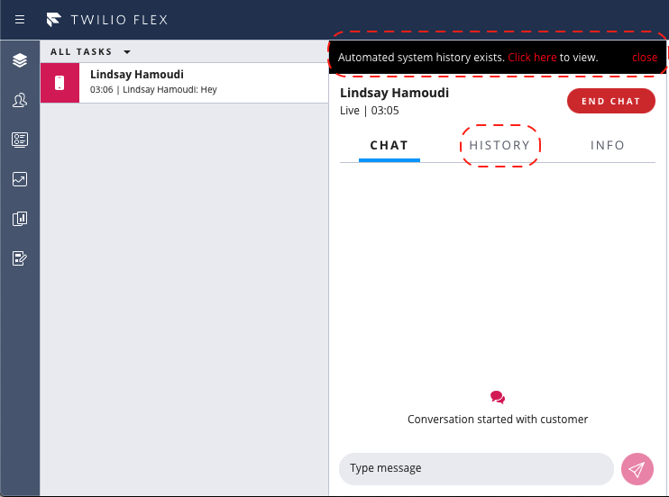
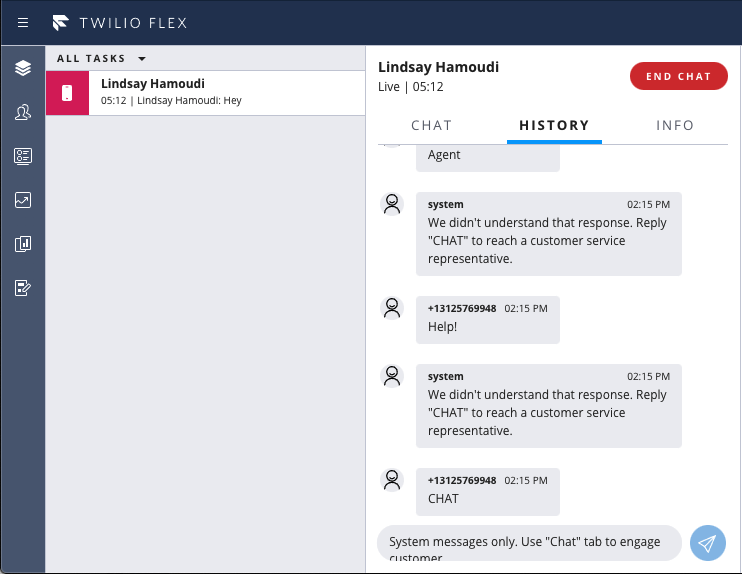

# Flex Plugin to Include Source Chat Channel

This is a very basic Flex Chat plugin to read a `sourceChatChannelSid` task attribute, and render the message history (from that "source" chat conversation) in a separate "History" tab within the Task Canvas. The inputs on that "History" tab are disabled - since the agent is probably not a participant in that chat channel.

The use case here is when a chat task is created from another chat conversation - such as when a customer requests to chat to an agent via an otherwise automated chat conversation managed through a Studio flow, against a different Twilio phone number (say a short code), and where there's a need to give the agent immediate access to that other chat conversation for context. 

## Long-Lived Channel Precautions

If you use long-lived channels, there's the potential for a new task to arrive for a chat channel that's still being wrapped up by your agent. Clicking "End Chat" on a long-lived chat task will only clear the proxy session between Twilio and the customer (but will keep the channel active). Therefore a further message from the customer would lead to a new proxy session and a new task - using the same long-lived chat channel.

The agent shouldn’t try to handle multiple tasks for the same channel at once. Otherwise when they hit "Complete" on one of those tasks - they will be removed from the channel, thus impacting the other task(s) that share that same chat channel.

Twilio Professional Services have a [standalone plugin](https://github.com/twilio-professional-services/plugin-alert-on-second-task-for-same-chat-channel) to help mitigate against this scenario, by guiding the agent towards wrapping up the existing task before accepting the new one. Fundamentally , this is a product bug for which these is an existing JIRA open with Twilio's Flex UI team.

## Injecting the sourceChatChannelSid attribute

Refer to [this Professional Services repository](https://github.com/twilio-professional-services/function-flex-outbound-sms) for example functions and guidance for triggering a new chat task (well, SMS in this case) via a REST call (such as from the aforementioned Studio flow).

## Screenshots





## About Twilio Flex Plugins

Twilio Flex Plugins allow you to customize the appearance and behavior of [Twilio Flex](https://www.twilio.com/flex). If you want to learn more about the capabilities and how to use the API, check out our [Flex documentation](https://www.twilio.com/docs/flex).

## Setup

Make sure you have [Node.js](https://nodejs.org) as well as [`npm`](https://npmjs.com). We support Node >= 10.12 (and recommend the _even_ versions of Node). Afterwards, install the dependencies by running `npm install`:

```bash
cd 

# If you use npm
npm install
```

Next, please install the [Twilio CLI](https://www.twilio.com/docs/twilio-cli/quickstart) by running:

```bash
brew tap twilio/brew && brew install twilio
```

Finally, install the [Flex Plugin extension](https://github.com/twilio-labs/plugin-flex) for the Twilio CLI:

```bash
twilio plugins:install @twilio-labs/plugin-flex
```

## Development

In order to develop locally, you can use the Webpack Dev Server by running (from the root plugin directory):

```bash
twilio flex:plugins:start
```

This will automatically start up the Webpack Dev Server and open the browser for you. Your app will run on `http://localhost:3000`. If you want to change that you can do this by setting the `PORT` environment variable:

When you make changes to your code, the browser window will be automatically refreshed.

## Deploy

When you are ready to deploy your plugin, in your terminal run:
```
Run: 
twilio flex:plugins:deploy --major --changelog "Notes for this version" --description "Functionality of the plugin"
```
For more details on deploying your plugin, refer to the [deploying your plugin guide](https://www.twilio.com/docs/flex/plugins#deploying-your-plugin).


